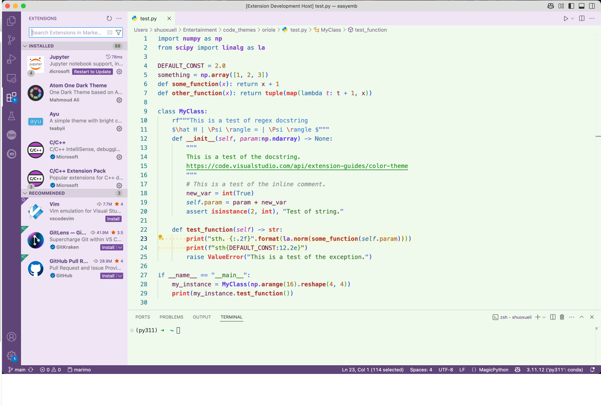

# Oriole color theme

Eye-friendly light color theme for vscode, mimicking the makeup of An Lingrong (called Consort Oriole in her last episodes) from the Chinese drama 'Empresses in the Palace'.

## Demo



`some inline code`

- [ ] list item 1
- [x] list item 2

``` python
def hello_world():
    print("Hello, world!")
```

$$
\begin{aligned}

    x^2 &= 4 \\
    \hat H | \Psi \rangle &= E | \Psi \rangle \\

\end{aligned}
$$


<br>
<br>
